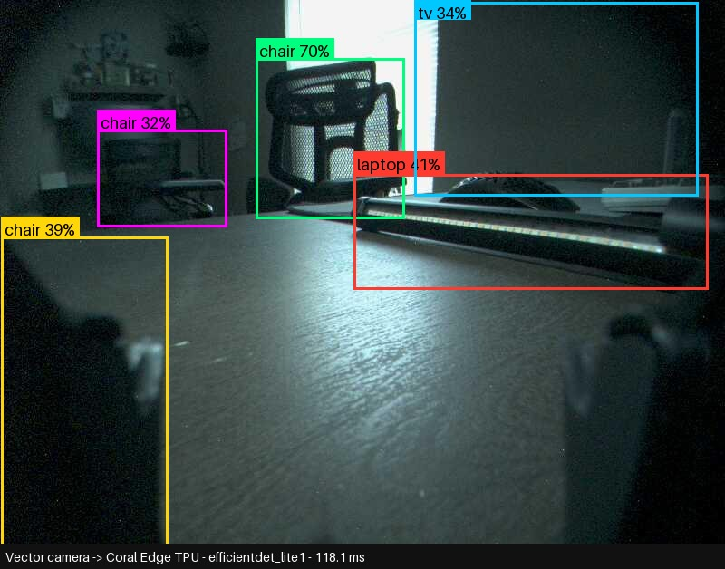

# vector-coral

Google Coral USB Edge TPU object-detection HTTP service, running on **gpu-host**
(GPU_HOST_IP), for Vector robot vision. Serves `POST /detect` and `GET /health`
on port **8095** and logs every request's image + result to
`~/vector-coral/captures/` as a future training dataset.

## Why a container

The host runs Python 3.14, which is far too new for `pycoral`/`tflite-runtime`
(Google never published wheels past cp39, i.e. Python 3.9). The container is
`debian:bullseye-slim`, which ships Python 3.9, plus `libedgetpu1-std` from
Google's Coral apt repo and the matching `tflite-runtime==2.5.0.post1` /
`pycoral~=2.0` wheels.

Debian 11 (bullseye) is EOL, so `deb.debian.org` 404s on it now. The
Dockerfile repoints `apt` at `archive.debian.org/debian bullseye main` (main
only — pulling in `bullseye-security`/`bullseye-updates` from the archive
conflicts with the `gpgv` version already baked into the `debian:bullseye-slim`
base image and breaks `gnupg` installation). The Coral apt repo's key is not
imported (`deb [trusted=yes] ...`) specifically to avoid needing `gnupg` at
all — installing it is what triggered the archive/base version conflict.

## USB / firmware re-enumeration (read this before you "fix" a crash)

A cold/fresh-power Coral USB Accelerator enumerates as `1a6e:089a Global
Unichip Corp.`. The **first** time `libedgetpu` opens it, it uploads firmware,
the device disconnects and re-enumerates as `18d1:9302 Google Inc.`, and the
USB bus/device path changes mid-open. This makes the very first
`edgetpu.make_interpreter()` call in a session fail with:

```
ValueError: Failed to load delegate from libedgetpu.so.1
```

`app.py`'s `init_models()` retries each model load up to 5 times with
backoff specifically to ride this out, so a normal `docker run`/restart
recovers on its own within ~10s and you'll see one or two
`attempt N/5 loading '...' failed` lines in the logs before it loads
cleanly — that's expected, not a bug. (Before the retry logic was added,
this crashed the process on first boot and Docker's `--restart
unless-stopped` policy silently recovered it on the second try instead —
you may see that pattern in very old logs.)

Once the device has re-enumerated once, it stays at `18d1:9302` until it's
unplugged or the host reboots.

## USB permissions

`/dev/bus/usb/002/005` (or whatever bus/device the Coral lands on) is
`root:root crw-rw-r--` by default — group has rw, but the group is `root`,
which a normal user isn't in. A udev rule was installed so the container
can run as the unprivileged `youruser` user (uid 1000) instead of root, which
keeps `captures/` naturally owned by `youruser` instead of `root`:

`/etc/udev/rules.d/99-edgetpu-accelerator.rules`:
```
# Google Coral USB Accelerator - allow plugdev group rw access
SUBSYSTEM=="usb", ATTRS{idVendor}=="1a6e", ATTRS{idProduct}=="089a", MODE="0664", GROUP="plugdev"
SUBSYSTEM=="usb", ATTRS{idVendor}=="18d1", ATTRS{idProduct}=="9302", MODE="0664", GROUP="plugdev"
```
`youruser` is already in the `plugdev` group (gid 46). The container is run with
`--user 1000:1000 --group-add 46` so it can open the device via that group
without being root or `--privileged`.

If the Coral is ever moved to a different USB port/host, re-apply with:
```bash
sudo udevadm control --reload-rules
sudo udevadm trigger --subsystem-match=usb
```

## Models

Both live in `models/`, downloaded from the `google-coral/test_data` repo.
Both are selectable per-request via `?model=`; `ssd_mobilenet_v2` is the
default.

| key | file | input | measured latency (this host) | notes |
|---|---|---|---|---|
| `ssd_mobilenet_v2` (**default**) | `ssd_mobilenet_v2_coco_quant_postprocess_edgetpu.tflite` | 300x300 | **~26-28ms** | fits the target 10-30ms range; default for a robot's live vision loop |
| `efficientdet_lite1` | `efficientdet_lite1_384_ptq_edgetpu.tflite` | 384x384 | **~88-98ms** | notably better recall/accuracy (caught couch/tv/chair that SSD missed), but too slow for the 10-30ms target — kept available for offline/higher-accuracy passes via `?model=efficientdet_lite1` |

`coco_labels.txt` (80 COCO classes) is shared by both models.

Both `inference_ms` numbers above measure only `interpreter.invoke()`
wall time, not image decode/resize/HTTP overhead, and were confirmed to be
running on the real Edge TPU (`tpu_present: true` in `/health`, and the
observed 26-28ms for SSD MobileNetV2 matches known Coral Edge TPU
benchmarks; a CPU fallback for this model on x86 would typically run
60-200ms+).

## Example output



## API

### `GET /health`
```json
{
  "status": "ok",
  "tpu_present": true,
  "tpu_error": null,
  "default_model": "ssd_mobilenet_v2",
  "models_loaded": ["ssd_mobilenet_v2", "efficientdet_lite1"],
  "uptime_s": 123.4
}
```

### `POST /detect`
Body: multipart form file field (any field name), or a raw JPEG body.

Query params:
- `model` — `ssd_mobilenet_v2` (default) or `efficientdet_lite1`
- `min_score` — float, default `0.4`

```bash
curl -X POST "http://GPU_HOST_IP:8095/detect?min_score=0.4" -F "image=@photo.jpg"
# or raw body:
curl -X POST "http://GPU_HOST_IP:8095/detect" --data-binary @photo.jpg -H "Content-Type: image/jpeg"
```

Response:
```json
{
  "model": "ssd_mobilenet_v2",
  "inference_ms": 26.72,
  "detections": [
    {"label": "person", "score": 0.8047, "box": [2, 4, 513, 595]}
  ]
}
```
`box` is `[x1, y1, x2, y2]` in source-image pixel coordinates.

## Captures (training dataset)

Every `/detect` request saves the submitted image and its result JSON to:
```
~/vector-coral/captures/YYYY-MM-DD/<HHMMSS_ffffff>.jpg
~/vector-coral/captures/YYYY-MM-DD/<HHMMSS_ffffff>.json
```
owned by `youruser`. Only the most recent **1000** (image, json) pairs are kept
across all date folders — oldest pairs are deleted automatically on every
request once the cap is exceeded. Capture failures never fail the `/detect`
response (logged to `docker logs vector-coral` instead).

## Network exposure

Binds `0.0.0.0:8095` (LAN-only by intent — there's no auth on this
service). `ufw` is **not active** on gpu-host (`ENABLED=no` in
`/etc/ufw/ufw.conf`), so there's no firewall rule to add; if ufw is ever
turned on here, allow only the LAN:
```bash
sudo ufw allow from LAN_SUBNET/24 to any port 8095 proto tcp
```

## Restart / redeploy

```bash
cd ~/vector-coral
docker build -t vector-coral:latest .
docker rm -f vector-coral
docker run -d \
  --name vector-coral \
  --network host \
  --restart unless-stopped \
  --device /dev/bus/usb \
  --user 1000:1000 \
  --group-add 46 \
  -v ~/vector-coral/captures:/app/captures \
  -v ~/vector-coral/models:/app/models:ro \
  vector-coral:latest
```
It also comes back automatically on container/Docker daemon restart via
`--restart unless-stopped` — no systemd unit needed.

Logs: `docker logs -f vector-coral`

## Remove

```bash
docker rm -f vector-coral
docker rmi vector-coral:latest
# optional — also drop the udev rule:
sudo rm /etc/udev/rules.d/99-edgetpu-accelerator.rules
sudo udevadm control --reload-rules
# captures/ and models/ are left on disk under ~/vector-coral/
# for the training dataset -- delete manually if you really want it gone:
# rm -rf ~/vector-coral
```

## Layout
```
~/vector-coral/
├── Dockerfile
├── README.md
├── app/
│   └── app.py
├── models/
│   ├── ssd_mobilenet_v2_coco_quant_postprocess_edgetpu.tflite
│   ├── efficientdet_lite1_384_ptq_edgetpu.tflite
│   └── coco_labels.txt
├── captures/                 # request images + detection JSON, youruser-owned
│   └── YYYY-MM-DD/
└── test_images/               # sample images used to validate the service
```
